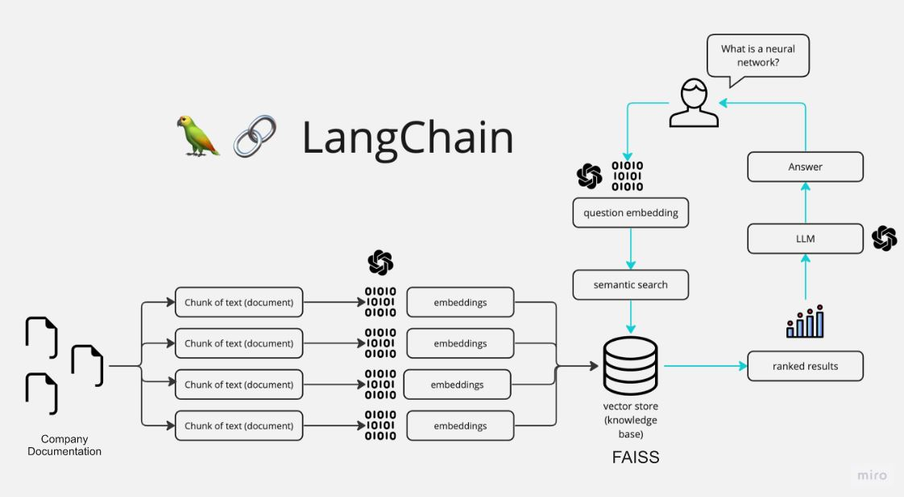

## Introduction

The Chat App is a Python application that allows you to chat about multiple documentation files. It can be run in 2 ways:

1. Locally by following the instructions provided for local deployment below
2. The deployed version on an AWS EC2 Instance at the address: http://16.16.68.233:8501

You can ask questions about the data using natural language, and the application will provide relevant responses based on the content of the documents. This app utilizes a language model to generate accurate answers to your queries. Please note that the app will only respond to questions related to the loaded documentation.

## How It Works



The application follows these steps to provide responses to your questions:

1. Data Loading: The app reads multiple .md documents and extracts their text content.

2. Text Chunking: The extracted text is divided into smaller chunks that can be processed effectively.

3. Language Model: The application utilizes a language model to generate vector representations (embeddings) of the text chunks.

4. Similarity Matching: When you ask a question, the app compares it with the text chunks and identifies the most semantically similar ones.

5. Response Generation: The selected chunks are passed to the language model, which generates a response based on the relevant content of the files provided.

## Dependencies and Installation


To install the  Chat App, please follow these steps:

1. Clone the repository to your local machine.

2. Install the required dependencies by running the following command:
   ```
   pip install -r requirements.txt
   ```

3. Obtain an API key from OpenAI and add it to the `.env` file in the project directory.
```commandline
OPENAI_API_KEY=your_secrit_api_key
```

## Local Configuration


To use the Chatbot App, follow these steps:

1. Ensure that you have installed the required dependencies and added the OpenAI API key to the `.env` file.

2. Run the `main.py` file using the Streamlit CLI. Execute the following command:
   ```
   streamlit run app.py
   ```

3. The application will launch in your default web browser, displaying the user interface.

4. Ask questions in natural language about the provided files using the chat interface.


## AWS EC2 Deployment


The application is also running on an EC2 instance on AWS. It can be acessed with the address: http://16.16.68.233:8501. 
For the deployment I used the configuration available for the free tier subscription, which is t3.micro. So far testing it I haven't encountered any issues with the limited capacity. However, for this solution to be production ready it would be wiser to run it on a larger instance with more processing power. 

The AWS Deployment version of the code is configured with my OPENAI_API_KEY and can be tested fully. Unfortunatelly I was not able to add the API key to this github repo for safety reasons. 


## Model


For the LLM model and embeddings I used the OpenAI versions. I tried running it with the Instructor XL embeddings model from Hugging Face, but it ran very slowly on my machine. However, if data privacy is an issue, then it justifies using a locally run model with bigger computing capacity. Please note that I have a limited amount of tokens for the OpenAI Services. 


## Data Input


In the streamlit application I have added a sidebar where the user can add new documentation, in case the documentation is updated or the scope of it has changed. When processing incoming data, I convert it to a .txt file to make it easier for the model to process the files, without any additional formatting issues. 


